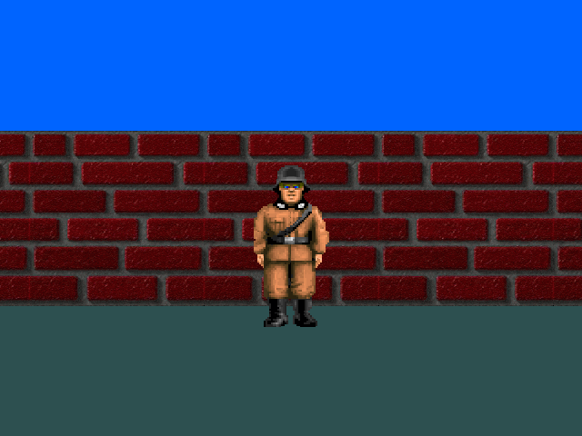

  

## Install
`sudo apt-get install libbsd-dev libx11-dev libxext-dev`

## Run
1. make all
2. ./cub3D maps/1-map.cub

## Controls
<kbd>A</kbd> <kbd>W</kbd> <kbd>S</kbd> <kbd>D</kbd> / <kbd>↑</kbd> <kbd>↓</kbd> <kbd>←</kbd> <kbd>→</kbd> : Move and Strafe
